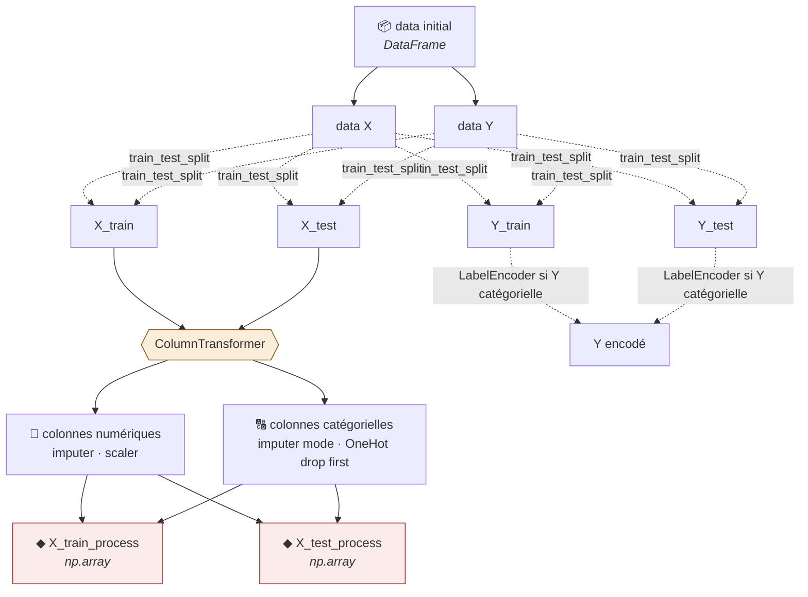

# 🧹 Fiche méthode · Preprocessing (sklearn)

> Un modèle ne lit que des **nombres sans NaN** → le preprocessing convertit le tableau.
> 🔑 **Split AVANT tout `fit`**. Tout ce qui apprend une statistique s'apprend sur le **train**.

## 🗺️ Le pipeline en un schéma

| Avant le preprocessing | Après |
|---|---|
| `DataFrame` → `df.head()` | `np.array` → `X_train_process[0:5, :]` |

## 🗂️ Type de variable → traitement

| Variable | NaN → | Transformation |
|---|---|---|
| 🔢 Numérique continue | moyenne · **médiane** si extrêmes | `StandardScaler` |
| 🔢 Numérique discrète | médiane | `StandardScaler` |
| 🔠 Nominale (pays…) | mode ou `"missing"` | `OneHotEncoder(drop="first")` |
| 🔠 Ordinale (mauvais → bon) | mode | `OrdinalEncoder` |
| 🎯 Cible Y | ligne **supprimée** | catégorielle : `LabelEncoder` · numérique : rien (`log` si asymétrique) |

## 🪜 Les étapes

### 🐼 Phase 1 · pandas (règles fixes)

| # | Étape | Code | Pourquoi |
|---|---|---|---|
| 1 | 📥 Charger | `df = pd.read_csv("data.csv")` | Tient dans un DataFrame = donnée structurée |
| 2 | 🔍 EDA | `df.describe(include="all")` `df.isnull().mean() * 100` | Repérer types, NaN, aberrations |
| 3 | 🗑️ Drop colonnes | `df.drop(cols, axis=1)` | ID, constante, > 60 % NaN, trop de modalités, colinéaires |
| 4 | 🗑️ Drop lignes | `df.dropna(subset=[target])` `df.loc[(df.Age > 0) \| df.Age.isnull()]` | Pas de Y = inutilisable · outliers (garder les NaN → imputer) |
| 5 | ✂️ X / Y | `Y = df[target]` `X = df.drop(target, axis=1)` | data X / data Y |

### ✂️ Phase 2 · split

| # | Étape | Code | Pourquoi |
|---|---|---|---|
| 6 | 🔀 Train / test | `X_train, X_test, Y_train, Y_test = train_test_split(X, Y, test_size=0.2, random_state=0)` | 4 jeux · test = données jamais vues · `stratify=Y` si classes déséquilibrées |

### ⚙️ Phase 3 · sklearn (briques → pipelines → aiguillage)

| # | Étape | Code | Pourquoi |
|---|---|---|---|
| 7 | 🧱 Briques | `numeric_imputer = SimpleImputer(strategy="median")` `standard_scaler = StandardScaler()` `categoric_imputer = SimpleImputer(strategy="most_frequent")` `one_hot_encoder = OneHotEncoder(drop="first", handle_unknown="ignore")` | Une brique = une transformation, réglable à part |
| 8 | 🔢 Pipeline num | `numeric_pipeline = Pipeline([("num_imputer", numeric_imputer),` `("scaler", standard_scaler)])` | Imputer puis mettre à l'échelle (moyenne 0, écart-type 1) |
| 9 | 🔠 Pipeline cat | `categoric_pipeline = Pipeline([("cat_imputer", categoric_imputer),` `("encoder", one_hot_encoder)])` | Mode puis 1 colonne / modalité · `drop` évite la colinéarité |
| 10 | 🔀 Aiguillage | `preprocessor = ColumnTransformer([("num", numeric_pipeline, num_cols),` `("cat", categoric_pipeline, cat_cols)])` | **Pipeline** = suite d'étapes · **ColumnTransformer** = quel pipeline sur quelles colonnes |
| 11 | ✅ X | `X_train_process = preprocessor.fit_transform(X_train)` `X_test_process = preprocessor.transform(X_test)` | ❌ jamais `fit` sur le test (fuite) · sortie = `np.array` |
| 12 | 🎯 Y | `le = LabelEncoder()` `Y_train = le.fit_transform(Y_train)` · `Y_test = le.transform(Y_test)` | Même règle que X · inutile si Y numérique |

### 🤖 Phase 4 · modèle

| # | Étape | Code | Pourquoi |
|---|---|---|---|
| 13 | 🏋️ Entraîner | `model = LogisticRegression().fit(X_train_process, Y_train)` | Toujours sur le train |
| 14 | 📊 Évaluer | `accuracy_score(Y_train, model.predict(X_train_process))` `accuracy_score(Y_test, model.predict(X_test_process))` | Train : a-t-il appris ? · Test : est-il robuste ? |

## 🔁 fit / transform

| | Train | Test / prod |
|---|:---:|:---:|
| `fit_transform` | ✅ | ❌ |
| `transform` | – | ✅ |

## ⚠️ Pièges

| Symptôme | Cause |
|---|---|
| `'ndarray' has no attribute 'head'` | Après `fit_transform` → `X_train_process[0:5, :]` |
| Score test trop beau | `fit` sur le test ou avant le split |
| `Found unknown categories` | Ajouter `handle_unknown="ignore"` |
| Lignes NaN disparues au filtre | Oubli de `\| df.col.isnull()` |

💡 Imputer numérique : **médiane** dans la démo Preprocessing (salaires extrêmes), **moyenne** dans la démo Régression. Choisir selon la présence de valeurs extrêmes.
💡 En pratique : `Pipeline([("pre", preprocessor), ("model", model)])` = un seul objet pour train, test et prod → voir `toolbox/ml_supervise_template.py`.
