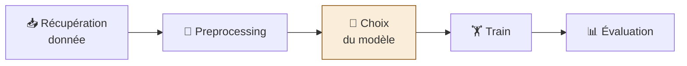

# 📈 Fiche méthode · Régression linéaire (sklearn)

> Régression = cible **numérique**. On cherche `f` telle que `X → f → Y`.
> La vraie relation est inaccessible → on l'**approxime** : `f_approx(X) + erreur = Y`, et on **minimise l'erreur**.



## 🧮 Le modèle : `Y = β₀ + β₁·X + ε`

> Linéaire = **rapport constant / proportionnalité**. C'est la relation la plus simple : « une droite, ça va dans une direction ».

| Terme | Nom | Sens | sklearn |
|---|---|---|---|
| `β₀` | Ordonnée à l'origine | Valeur de Y quand X = 0 → **position** de la droite | `reg.intercept_` |
| `β₁` | Pente | **Inclinaison** : croît ? décroît ? à quelle vitesse ? X + 1 → Y + β₁ en moyenne | `reg.coef_` |
| `ε` | Erreur / résidu | Part de la prédiction non expliquée : `Y_true − Y_pred` | – |
| Multiple | `Y = β₀ + β₁·X₁ + … + βₚ·Xₚ + ε` | **+1 β par variable** → permet de quantifier l'importance de chaque variable | – |

🎯 Rôle du data scientist : trouver le bon `f` = trouver les bons `β` en minimisant l'erreur.

## ⚙️ Optimisation : fonction de perte + OLS

```
erreur_i = yi_true − yi_pred         yi_pred = f_approx(xi) = β₀ + β₁·xi

OLS :   min  Σ (yi_true − yi_pred)²   =   min  Σ εi²
       β₀,β₁ i=1..n                         i=1..n
```

| Notion | À retenir |
|---|---|
| Loss / Cost | Fonction qui modélise l'erreur, à **minimiser** en jouant sur les β |
| OLS (moindres carrés) | Carré = **distance euclidienne** entre vecteur vérité et vecteur prédiction |
| Surface de coût | Loss(β₁, β₂) : l'entraînement cherche son point le plus bas |

## ✅ Hypothèses

| Hypothèse | Signifie | Visuel / vérification |
|---|---|---|
| 📐 Linéarité | **Postulée**, confirmée seulement après train + test. Linéaire **en β** : `log X`, `X²`, `sin X` restent OK (« forme modifiée de X ») | Nuage Y vs X |
| 📊 Homoscédasticité | Variance des résidus **constante** | ✅ bande parallèle · ❌ **entonnoir** (hétéroscédasticité) → problème plus complexe |
| 🎲 Indépendance des résidus | Chaque εi ne dépend que de (xi, yi) et des β | Résidus dépendants → impossible d'optimiser correctement |
| 🚫 Non-colinéarité *(multiple)* | Deux colonnes liées linéairement portent **la même info, la même variance** → polluent le modèle | Matrice de corrélation (âge / année de naissance) |

💡 Modèle **sensible aux outliers** → nettoyage indispensable.

## 📏 Normaliser ?

| | Sans normalisation | Avec normalisation |
|---|---|---|
| Échelles (âge ~ 10¹, salaire ~ 10⁵) | β très étirés les uns par rapport aux autres | Même échelle |
| Surface de coût | Allongée, plus large → entraînement **plus long et moins sûr** | Régulière → convergence rapide |
| Lecture de βᵢ | « +1 an → +βᵢ € » | « +1 écart-type → +βᵢ € » |
| Comparer les β | ❌ | ✅ |

➡️ **On normalise.** (Nuance du cours écrit : avec OLS calculé directement, le R² est identique dans les deux cas ; l'argument « surface de coût » vaut pour les entraînements itératifs.)

## 📊 Évaluation : R²

```
SST = Σ(yᵢ − ȳ)²   total      ∝ Var(Y)  (information totale)
SSE = Σ(ŷᵢ − ȳ)²   expliquée            (ce que le modèle capte)
SSR = Σ(yᵢ − ŷᵢ)²  résiduelle = Σ εᵢ²   (l'erreur)

R² = 1 − SSR / SST  ∈ [0 ; 1]  = part de variance expliquée
```

| Pour qui | Phrase |
|---|---|
| 📏 Loss (SSR) | « Voici la distance entre ma prédiction et la réalité » |
| 💬 R² (au métier) | « Mon modèle explique x % de la variance du problème » |

⚠️ R² **augmente toujours** quand on ajoute une feature → comparer des modèles à nombre de features égal, et regarder le **test**.

## 🎯 Train vs test : underfitting / overfitting

| Score sur… | Question |
|---|---|
| Train | Le modèle a-t-il **bien appris** ? |
| Test | Est-il **robuste** sur des données jamais vues ? |

| | 😴 Underfitting | ✅ Bon modèle | 🤯 Overfitting |
|---|---|---|---|
| R² train | **mauvais** | bon | très bon |
| R² test | mauvais | proche du train | **mauvais par rapport au train** |
| Cause | Manque de variables, modèle inadapté | – | Apprend le bruit du train |
| Remède | + features, `X²` / `log X`, autre modèle | – | − features, + données, régularisation (Ridge), validation croisée |

## 🪜 Les étapes

### 🔍 Phase 1 · EDA

| # | Étape | Code | Pourquoi |
|---|---|---|---|
| 1 | 📥 Charger | `df = pd.read_csv("src/Data.csv")`<br>`df.describe(include="all")` | NaN, types, échelles |
| 2 | 📊 Univarié | `px.histogram(df[col])` · `px.bar(df[col])` | Distributions, outliers |
| 3 | 🔗 Corrélations | `corr = df.corr(numeric_only=True).round(2)`<br>`px.imshow(corr, text_auto=True)` | Bons scores de corrélation avec Y = bonne direction · repérer la colinéarité |
| 4 | 🔀 Bivarié | `px.scatter_matrix(df)` | Relation linéaire visible ? |

### 📏 Phase 2 · Baseline (1 variable)

| # | Étape | Code | Pourquoi |
|---|---|---|---|
| 5 | ✂️ X / Y | `X = df[["YearsExperience"]]` *(double crochet)* · `Y = df["Salary"]` | La feature la plus corrélée |
| 6 | 🔀 Split | `train_test_split(X, Y, test_size=0.2, random_state=0)` | Avant tout fit |
| 7 | ⚙️ Preprocessing | `pre = Pipeline([("imputer", SimpleImputer(strategy="median")), ("scaler", StandardScaler())])`<br>`X_train = pre.fit_transform(X_train)` · `X_test = pre.transform(X_test)` | 1 colonne → pas de `ColumnTransformer` |
| 8 | 🏋️ Entraîner | `reg = LinearRegression().fit(X_train, Y_train)` | OLS |
| 9 | 📊 R² | `r2_score(Y_train, reg.predict(X_train))`<br>`r2_score(Y_test, reg.predict(X_test))` | Référence à battre |
| 10 | 👁️ Visualiser | `px.scatter(x=X_test.flatten(), y=Y_test)` + `go.Scatter(x=…, y=Y_test_pred)` | Vérifier linéarité / homoscédasticité |

### ➕ Phase 3 · Multiple

| # | Étape | Code | Pourquoi |
|---|---|---|---|
| 11 | ✂️ X / Y | `X = df[["Country", "Department", "Age", "YearsExperience", "EducationLevel"]]` | Toutes les features utiles |
| 12 | 🏷️ Types auto | `num = X.select_dtypes("number").columns.tolist()`<br>`cat = X.select_dtypes(exclude="number").columns.tolist()` | Évite de lister à la main |
| 13 | ⚙️ Preprocessing | `ColumnTransformer([("num", Pipeline([imputer mean, scaler]), num),`<br>`("cat", OneHotEncoder(drop="first"), cat)])` | **Piège des dummies** : elles somment à 1 → colinéarité |
| 14 | 🏋️📊 Fit + R² | idem 8-9 | R² test > baseline ? |

### ⚖️ Phase 4 · Interpréter

| # | Étape | Code | Pourquoi |
|---|---|---|---|
| 15 | 🏷️ Noms | `names = pre.get_feature_names_out()` | Relier chaque β à sa colonne |
| 16 | ⚖️ Coefficients | `coefs = pd.DataFrame({"coef": reg.coef_}, index=names)`<br>`coefs.reindex(coefs.coef.abs().sort_values().index)` | Importance = **valeur absolue** · signe = sens de l'effet |
| 17 | 📊 Graphique | `px.bar(coefs, orientation="h")` | Lecture rapide |

## ⚠️ Pièges

| Symptôme | Cause |
|---|---|
| `could not convert string to float` sur `df.corr()` | pandas ≥ 2 : `numeric_only=True` |
| `Expected 2D array` | `df["col"]` → `df[["col"]]` |
| R² train ≫ R² test | Overfitting |
| R² train faible | Underfitting |
| Coefficients énormes, instables | Colinéarité (dummies sans `drop`, features redondantes) |
| Classement d'importance faux | Sans `abs()` ou sans standardisation |
